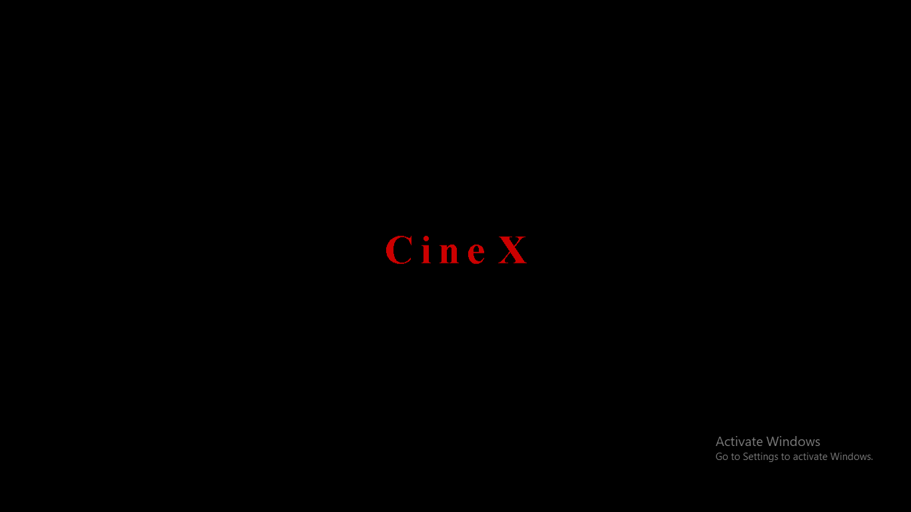
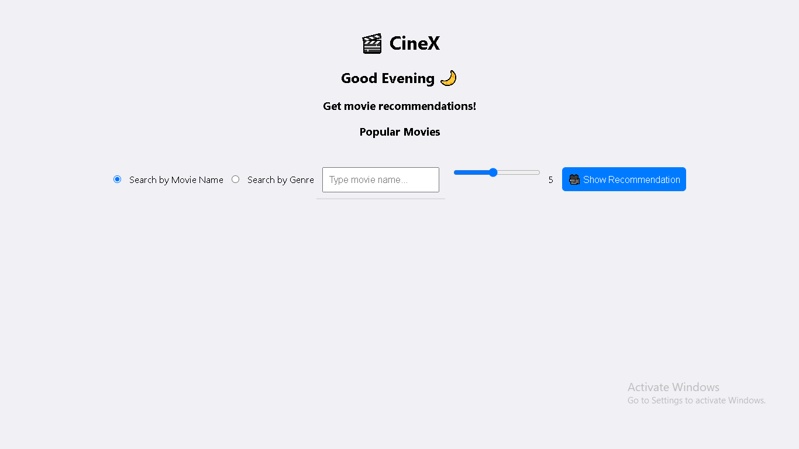
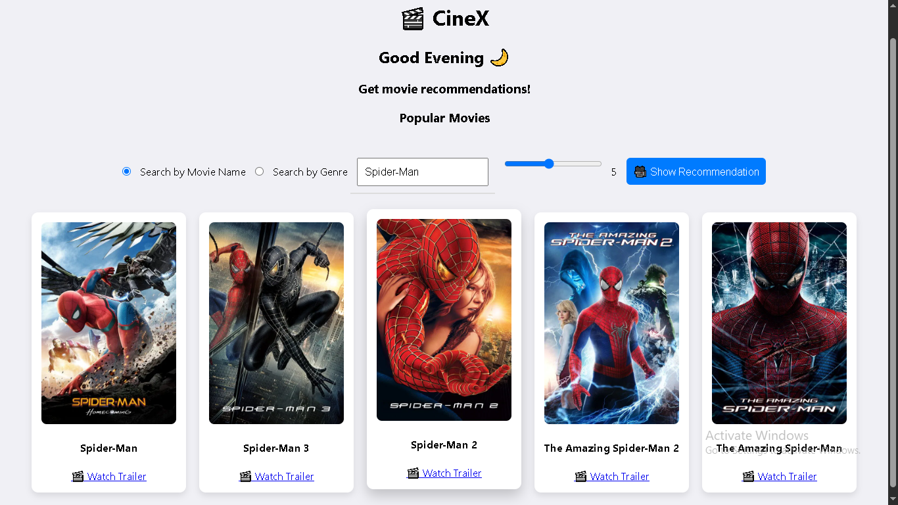

# 🎬 Movie Recommender System

A machine learning-based movie recommendation system built with Python and Streamlit. This system suggests movies based on user input (either by movie title or genre) and provides posters and trailers fetched using the TMDB API.

## 🚀 Features

- 🔍 **Search by Movie Name** – Get recommendations based on a specific movie.
- 🎭 **Search by Genre** – Find movies within a selected genre.
- 📽️ **Movie Posters & Trailers** – Fetch movie images and trailers from TMDB.
- 🎯 **Machine Learning-Based Recommendations** – Uses cosine similarity for recommendations.
- 🌎 **Real-Time Greeting System** – Displays a greeting message based on the time of the day.

---

## 📂 Project Structure

```
📁 Movie-Recommender-System
│── model/
│   ├── movie_list.pkl        # Pickle file containing movie data
│   ├── similarity.pkl        # Precomputed similarity matrix
│   ├── movies.csv            # Movie dataset
│   ├── credits.csv           # Movie credits dataset
│── app.py                    # Main Streamlit application
│── requirements.txt           # Python dependencies
│── README.md                  # Project documentation
|── notebook86c26b4f17.ipynb
```

---

## ⚙️ Installation

### 🔹 1. Clone the Repository

```bash
git clone https://github.com/yourusername/Movie-Recommender-System.git
cd Movie-Recommender-System
```

### 🔹 2. Create a Virtual Environment (Optional but Recommended)

```bash
python -m venv env
source env/bin/activate   # On macOS/Linux
env\Scripts\activate      # On Windows
```

### 🔹 3. Install Dependencies

```bash
pip install -r requirements.txt
```

### 🔹 4. Run the notebook86c26b4f17.ipynb file

Place `movie_list.pkl` and `similarity.pkl` inside the `model/` directory.

### 🔹 5. Run the Application

```bash
python -m streamlit run app.py
```

---

## 🛠️ How It Works

1. **Data Loading**: The system loads movie data (`movies.csv`, `credits.csv`).
2. **Preprocessing**: Extracts genres and prepares data for recommendations.
3. **Machine Learning Model**: Uses a precomputed similarity matrix (`similarity.pkl`).
4. **Movie Recommendation**: Finds similar movies based on cosine similarity.
5. **Poster & Trailer Fetching**: Calls TMDB API to get movie details.
6. **Streamlit UI**: Provides an interactive web-based interface.

---

## 🖼️ Screenshots

| Loading Page | Home Screen | Search Movie |
|-------------|----------------------|
|  |  |  |


## 🔑 API Usage

This project uses [TMDB API](https://www.themoviedb.org/documentation/api) to fetch movie details.

- To use this API, get an API key from TMDB.
- Replace `TMDB_API_KEY` in `app.py` with your own key.

```python
TMDB_API_KEY = "your_tmdb_api_key_here"
```

---

## 🔮 Future Enhancements

- ✅ Add personalized recommendations based on user history.
- ✅ Improve UI/UX with better styling and animations.
- ✅ Implement user authentication (Firebase) for a personalized experience.

---

## 👨‍💻 Contributors

- **Ujjal** - *Developer*

---


